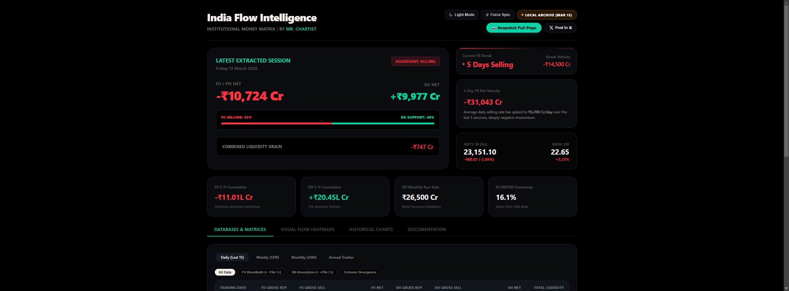
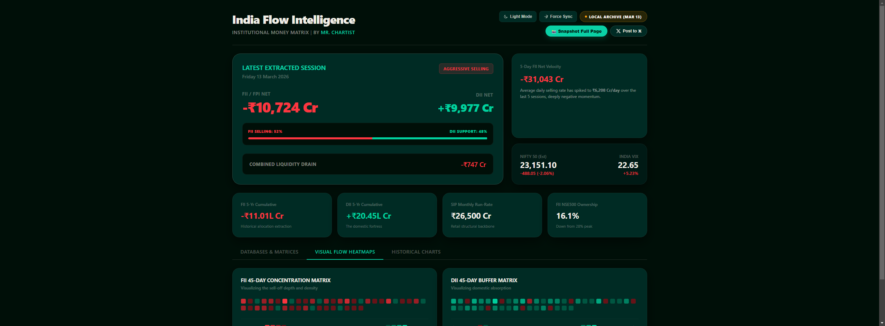
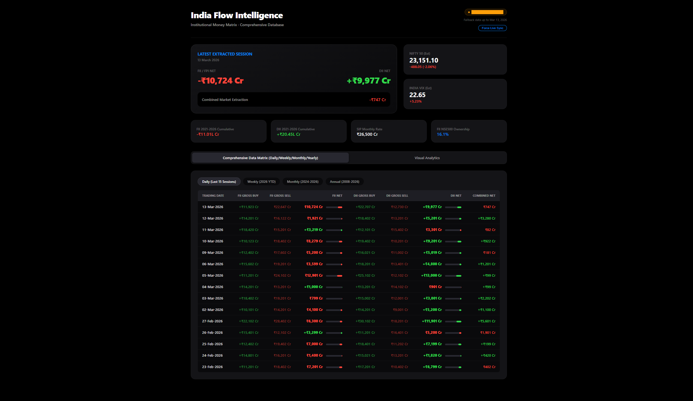

# 📊 FII & DII Data — India Institutional Flow Intelligence

> **The most advanced open-source terminal for tracking Foreign Institutional Investor (FII) & Domestic Institutional Investor (DII) flows in the Indian equity markets.**

Built by [Mr. Chartist](https://twitter.com/mr_chartist) — **100% free, open-source, no backend, no login.**

---

## 🚀 Live Demo

Open `fii_dii_india_flows_dashboard.html` in any browser. No server needed.

[](https://github.com/mr-chartist/fii-dii-data)
[](LICENSE)
[](fii_dii_india_flows_dashboard.html)
[](https://twitter.com/mr_chartist)

---

## ✨ Features

| Feature | Description |
|---|---|
| 🔴 **Live NSE Sync** | Auto-fetches today's FII/DII data from NSE via CORS proxy on every page load |
| 📊 **Flow Strength Meter** | Animated FII vs DII aggression gauge — instantly tells you who's driving the market |
| 🔥 **FII Streak Counter** | Tracks consecutive buying/selling sessions with velocity (total ₹ flow during streak) |
| 🌡️ **Visual Heatmaps** | GitHub-style 45-day concentration matrices with hover magnification for FII & DII |
| 🔍 **Smart Data Filters** | One-click filters: FII Bloodbath, DII Absorption, Extreme Divergence |
| 📈 **Historical Charts** | Interactive Chart.js bar & area charts across 12-month and 14-year data |
| 📷 **Widget Snapshot** | Hover any card → export as high-DPI PNG with embedded watermark |
| 𝕏 **Post to X / Twitter** | Pre-filled tweet with today's exact institutional flow data |
| 🌗 **OLED Dark / Sand Light** | Pure matte black + sand white theme toggle with live chart re-rendering |
| 📱 **Fully Responsive** | Works beautifully on mobile, tablet, and desktop |

---

## 📸 Screenshots

### Hero Dashboard — OLED Dark Mode
Shows the latest session data, FII streak widget, Flow Strength Meter, and market context cards.


### Visual Flow Heatmaps
GitHub-style 45-day FII & DII concentration matrices. Each cell = one trading day. Hover to magnify.


### Data Matrix with Smart Filters
Daily, Weekly, Monthly, and Annual data tables. Filter by FII Bloodbath (>₹5k Cr sell), DII Absorption, or Extreme Divergence.


---

## 🧠 How to Use

### Quick Start
1. **Download** or clone this repo
2. **Open** `fii_dii_india_flows_dashboard.html` in Chrome, Edge, or Firefox
3. The terminal auto-syncs with NSE data on load

```bash
git clone https://github.com/mr-chartist/fii-dii-data.git
cd fii-dii-data
# Just open the HTML file — no npm, no server needed!
start fii_dii_india_flows_dashboard.html
```

### Status Indicators
| Indicator | Meaning |
|---|---|
| 🟢 **LIVE SYNC** | Today's data fetched successfully from NSE |
| 🟡 **LOCAL ARCHIVE** | Markets closed / API rate-limited. Fallback embedded 15-day archive active |

### Force Sync
Click **"Force Sync"** in the top-right header to manually trigger a fresh NSE data pull mid-session.

---

## 📖 Reading the Dashboard

### Flow Strength Meter
Calculates the **relative aggression** of FII vs DII in absolute flow terms:
- **FII Bar (Red) > 70%** → FIIs are the dominant force
- **FII Sell 80% + DII Buy 20%** → 🚨 Panic sell with little domestic support
- **FII Sell 80% + DII Buy 80%** → ✅ Structural rotation — not a free fall

### FII Streak Counter
Tracks consecutive sessions FII stays on one side:
- **🔴 Sell Streak 10+ days** at ₹5,000+ Cr/day = historically extreme oversold 
- **🟢 Buy Streak 5+ days** = strong confirmation of trend reversal / FII re-entry
- **Streak Velocity** = cumulative ₹ Cr damage or firepower during that streak

### Heatmap Color Scale
| Color | Meaning |
|---|---|
| 🔴 Deep Red | Extreme FII dump (>80% of max) |
| 🟠 Mid Red | Heavy selling |
| 🟡 Light Red | Light net selling |
| 🟢 Light Green | Light net buying |
| 💚 Deep Green | Heavy accumulation |

### Smart Filters (Daily Matrix)
| Filter | Trigger |
|---|---|
| **All Data** | Every session in archive |
| **FII Bloodbath** | FII net sold > ₹5,000 Cr |
| **DII Absorption** | DII net bought > ₹5,000 Cr |
| **Extreme Divergence** | FII sold ≥ ₹8,000 Cr AND DII bought ≥ ₹8,000 Cr |

---

## 🛠️ Tech Stack

| Technology | Purpose |
|---|---|
| **Vanilla HTML/CSS/JS** | Core — zero dependencies, zero build step |
| **Chart.js 3.9** | Monthly bar charts & cumulative area charts |
| **html2canvas** | High-DPI widget snapshot export |
| **NSE India API** | Live FII/DII data source |
| **allorigins.win** | CORS proxy to access NSE from browser |

---

## 📊 Data Coverage

| Timeframe | Coverage |
|---|---|
| Daily | Last 15 trading sessions |
| Weekly | Last 10 weeks |
| Monthly | Last 12 months |
| Annual | 2013 – 2026 (14 years) |

> **Note:** The local archive is embedded directly in the HTML. For live updates, the NSE API is queried on every page load.

---

## 🔧 Customizing the Data

All data is embedded in the `<script>` tag inside `fii_dii_india_flows_dashboard.html`. To update:

```javascript
const dailyData = [
  { d:"15-Mar-2026", fb:12000, fs:20000, fn:-8000, db:18000, ds:10000, dn:8000 },
  // d = date, fb = FII buy, fs = FII sell, fn = FII net, db = DII buy, ds = DII sell, dn = DII net
  ...
];
```

---

## 🤝 Contributing

This is an open-source project — PRs, issues, and stars are welcome!

1. Fork this repo
2. Create a feature branch: `git checkout -b feature/your-feature`
3. Commit your changes: `git commit -m 'Add your feature'`
4. Push and open a PR

### Ideas for Contributions
- [ ] Add Nifty 50 overlay on flow charts
- [ ] Add sector-wise FII flow breakdown
- [ ] Export to CSV from the data matrix
- [ ] Add more intelligent alerts (e.g., send notification on extreme sessions)
- [ ] Add GitHub Actions to auto-update data daily

---

## 📜 License

MIT License — use it, fork it, ship it, share it. Attribution appreciated but not required.

---

## 👨‍💻 Author

Built with ❤️ by [Mr. Chartist](https://twitter.com/mr_chartist)

If this tool helps your trading or analysis, a ⭐ on GitHub and a follow on X would mean a lot!

[](https://twitter.com/mr_chartist)

---

*Disclaimer: This tool is for educational and informational purposes only. Not financial advice. Always do your own research before making investment decisions.*
